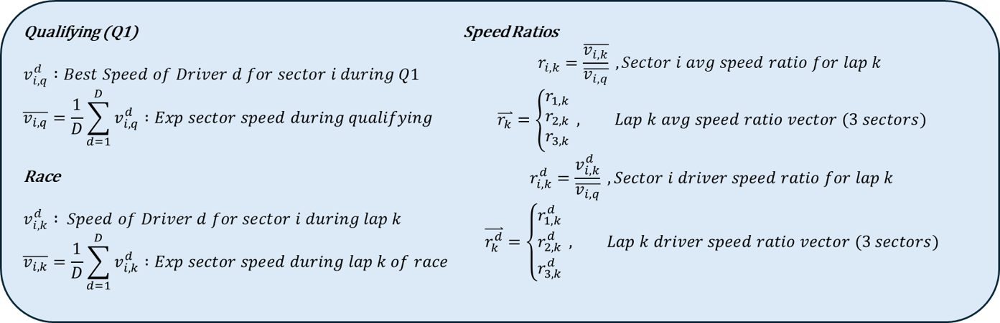
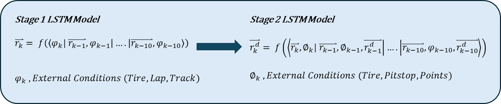
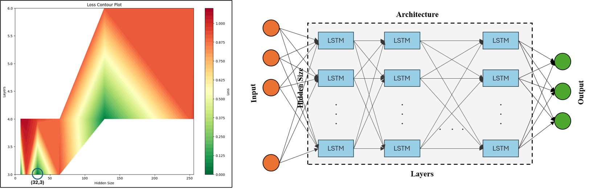
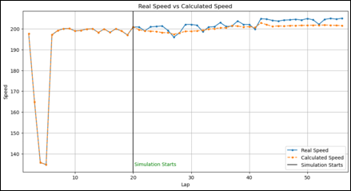
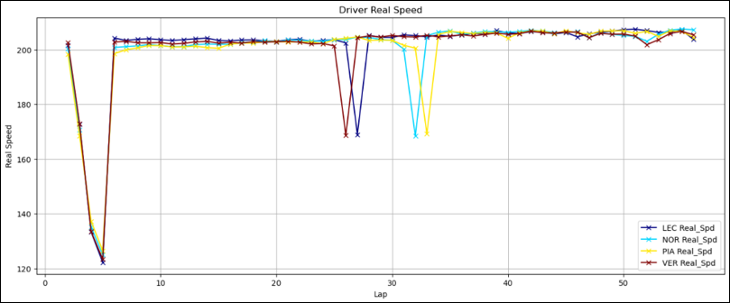
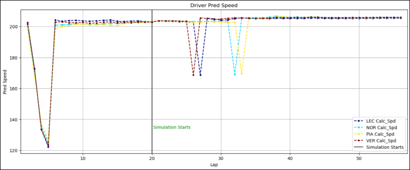
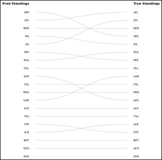

# F1 Race Predictor LSTM
An LSTM Model to predict the speeds and outcomes of a Formula 1 Race

## INTRODUCTION
This project aims to develop a predictive model for race outcomes using publicly available data from the FastF1 library. While critical data like tire temperature is proprietary to F1 teams and unavailable, the model leverages accessible data such as tire type, tire life, and sector durations for each session (including qualifying and race). These data points form the basis for effectively estimating driver performance despite data limitations.

## PROBLEM STATEMENT

Develop a model to estimate a driver's lap time during a race based on tire changes and available data. The model's predicted lap times will be compared to actual performance, with differences visualized graphically to assess accuracy.

## SOLUTION OVERVIEW

F1 Race Terminology

The model employs a two-stage approach to predict race outcomes:

### Stage 1: Average Lap Speed
An LSTM network predicts the average speed of all drivers for a specific lap of the race. This stage takes as input the average fastest Q1 sector speeds of all drivers and focuses on capturing factors that affect all drivers equally, such as track, lap and weather conditions.

### Stage 2: Driver Lap Speed
An LSTM network predicts the lap speed of a specific driver, given the average lap speed from Stage 1. This stage accounts for individual driver characteristics and deviations from the average, including driving style and car performance.

### Why the Two-Stage Approach
Dividing the problem allows each LSTM network to specialize in a specific task. The first network models general factors affecting all drivers, while the second focuses on individual nuances.

## LSTM Architecture Decisions (Stage 1 and Stage 2)

The best performing architecture is 32 units wide and 3 layers deep

## MODEL TRAINING

The best-performing LSTM architecture tested has 32 units per layer and is 3 layers deep. It was implemented in PyTorch and executed on a Google Colab environment equipped with an A100 GPU.

## RESULTS

Graphs are generated in the Jupyter Notebook. The ANN model is able to capture a general trend but misses out on minor nuances which are not captured by the publicly available data

### Stage 1

### Stage 2

**Real Speed**

**Pred Speed**

### Race Standings

