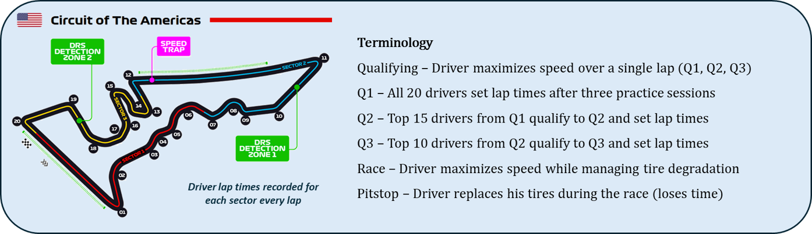
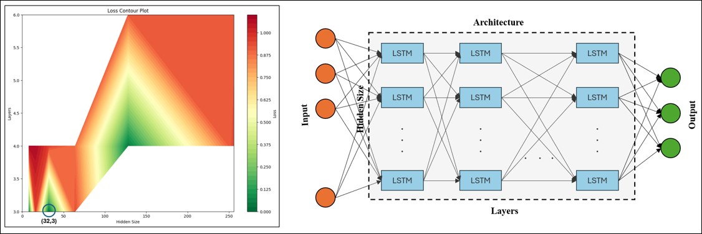

# F1 Race Predictor LSTM
A 2 stage LSTM Model to predict the driver speeds and final outcome of a Formula 1 Race.

## Table of Contents
- [Introduction](#introduction)
- [Installation Instructions](#installation-instructions)
- [Problem Statement](#problem-statement)
- [F1 Background](#f1-background)
- [Quick Baseline Model](#quick-baseline-model)
  - [Baseline Model Error Metric (M.A.P.E)](#baseline-model-error-metric-mape)
  - [Baseline Model Key Takeaways](#baseline-model-key-takeaways)
- [Solution Overview](#solution-overview)
  - [Stage 1: Average Lap Speed](#stage-1-average-lap-speed)
  - [Stage 2: Driver Lap Speed](#stage-2-driver-lap-speed)
  - [Why the Two-Stage Approach](#why-the-two-stage-approach)
- [Metrics Definition](#metrics-definition)
- [Mathematical Formulation](#mathematical-formulation)
- [Model Training](#model-training)
  - [Training/Validation Split](#trainingvalidation-split)
  - [LSTM Architecture (Stage 1 and Stage 2)](#lstm-architecture-stage-1-and-stage-2)
- [Race Simulation](#race-simulation)
- [Results](#results)
  - [Stage 1](#stage-1)
    - [Business Metric (Mean Lap Speed)](#business-metric-mean-lap-speed)
    - [Error Metric (M.A.P.E)](#error-metric-mape)
  - [Stage 2](#stage-2)
    - [Business Metric (Driver Lap Speed)](#business-metric-driver-lap-speed)
    - [Error Metric (M.A.P.E)](#error-metric-mape-1)
    - [Business Metric (Driver Relative Position)](#business-metric-driver-relative-position)
    - [Error Metric (M.A.E)](#error-metric-mae)
  - [Race Standings](#race-standings)
- [Future Improvements](#future-improvements)

## Introduction
This project aims to develop a predictive model for race outcomes using publicly available data from the FastF1 library. While critical data like tire temperature is proprietary to F1 teams and unavailable, the model leverages accessible data such as tire type, tire life, and sector durations for each session (including qualifying and race). These data points form the basis for effectively estimating driver performance despite data limitations.

## Installation Instructions

1) Download Python 3.11 (https://www.python.org/downloads/release/python-3110/)

2) Clone the github repo

'''
	
	git clone https://github.com/vishalkk96/F1_Race_Pred_LSTM.git
	
	cd <repo-location>
'''

3) Create a new virtual environment (Optional)

'''
	
	python -m venv venv

'''

4) Install the libraries in the requirements file

'''
	
	pip install -r requirements.txt

'''

## Problem Statement

Develop a model to get the individual driver lap data for the first 20 laps and predict the performance of each driver until the end of the race. 

## F1 Background

F1 Race Terminology

## Quick Baseline Model

A quick vector (All 3 sector speeds) autoregression model is built to define a performance baseline for any model development. The time series variable is the ratio between the race lap sector speed and qualifying lap sector speed. Stationarity is ensured by using the first difference of the variables.

**Baseline Model Error Metric (M.A.P.E)**

The above result is for the 2024 United States Grand Prix held in Austin, TX.

**Baseline Model Key Takeaways**

1) The error % increases steadily by compounding with the num of laps. This is because future laps are predicted based on past laps which themselves are predictions.

2) Outlaps show a greater error % indicating the significance of auxiliary lap information for predicting driver performance.

3) Auxiliary information about the tire, track, lap, driver points, pitstops (outlaps and inlaps) is necessary for the model.

4) A non linear model is required to model the lapwise performance.

## Solution Overview

The model employs a two-stage approach to predict race outcomes:

### Stage 1: Average Lap Speed

An LSTM network predicts the average speed of all drivers for a specific lap of the race. This stage takes as input the average fastest Q1 sector speeds of all drivers and focuses on capturing factors that affect all drivers equally, such as track, lap and weather conditions.

### Stage 2: Driver Lap Speed

An LSTM network predicts the lap speed of a specific driver, given the average lap speed from Stage 1. This stage accounts for individual driver characteristics and deviations from the average, including driving style and car performance.

### Why the Two-Stage Approach

Dividing the problem allows each LSTM network to specialize in a specific task. The first network models general factors affecting all drivers, while the second focuses on individual nuances.

## Metrics Definition

## Mathematical Formulation

## Model Training

### Training/Validation Split

The model has been trained on race data from 2019 upto the end of Apr 2024 excluding 2022 (2022 Race data was corrupted in the FastF1 library during my data extraction attempts). The validation data comprises of 19 races from May 2024 onwards.

### LSTM Architecture (Stage 1 and Stage 2)

The best-performing LSTM architecture tested has 32 units per layer and is 3 layers deep.

It was implemented in PyTorch and executed on a Google Colab environment equipped with an A100 GPU.

## Race Simulation

Driver lap speeds are collected for the first n laps (default 20) and then projected using stagewise LSTM models until the race ends. Future pitstop decisions and driver DNFs are incorporated, and can be adjusted to explore alternative scenarios. However, to compare the model’s outputs with actual race performance, the original conditions are retained.  

## Results

Graphs are generated in the Jupyter Notebook. The ANN model is able to capture a general trend but misses out on minor nuances which are not captured by the publicly available data. The following results are for the 2024 United States Grand Prix held in Austin, TX. 

### Stage 1

**Business Metric (Mean Lap Speed)**

The predicted mean lap speed superimposed on the actual mean lap speed.

**Error Metric (M.A.P.E)**

### Stage 2

**Business Metric (Driver Lap Speed)**

The actual driver lap speeds.

The predicted driver lap speeds.

**Error Metric (M.A.P.E)**

**Business Metric (Driver Relative Position)**

The actual driver lap positions (Z-Score).

The predicted driver lap positions (Z-Score).

**Error Metric (M.A.E)**

### Race Standings

The predicted v/s actual driver race finishing positions.

Pearson correlation co-efficient (Pred finish v/s Actual finish).

## Future Improvements

The model relies upon the pitstop decisions made by the teams during the race. A future update could include pitstop decision/ race strategy as an output.